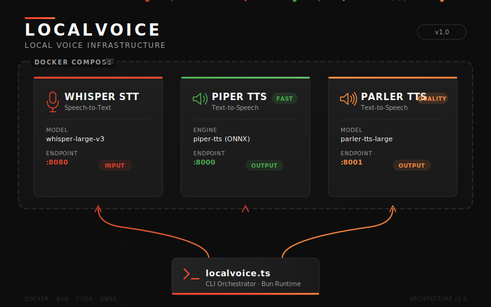
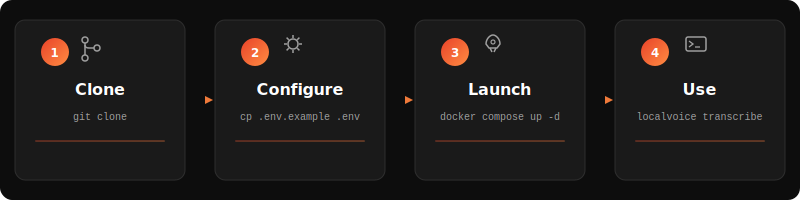
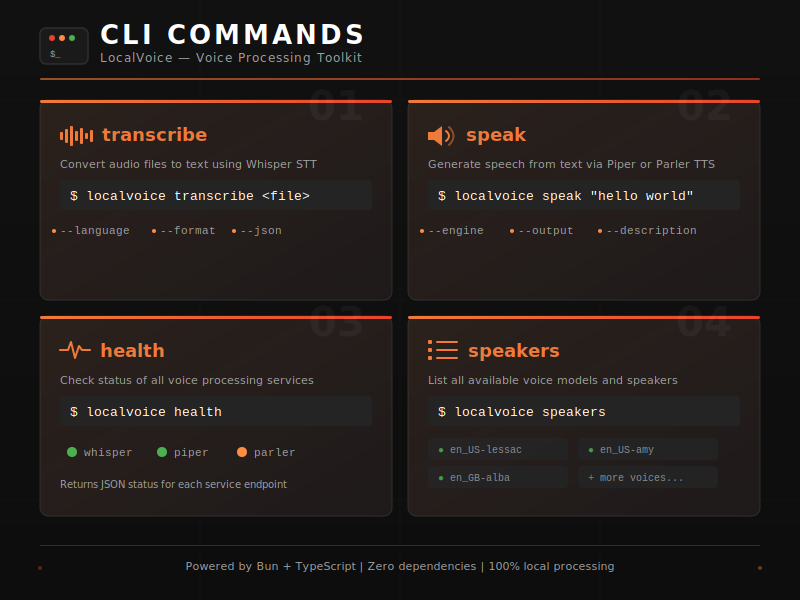

<p align="center">
  
</p>

# LocalVoice

**Local voice infrastructure** — Speech-to-Text and Text-to-Speech APIs running entirely on your hardware. No cloud, no API keys, no data leaving your network.

Built on Docker with [whisper.cpp](https://github.com/ggml-org/whisper.cpp) for STT and [Piper](https://github.com/rhasspy/piper) / [Parler-TTS](https://github.com/huggingface/parler-tts) for speech synthesis. Includes a zero-dependency TypeScript CLI for instant access to all services.

---

<p align="center">
  
</p>

## Quick Start

```bash
# 1. Clone
git clone https://github.com/getrav/localvoice.git
cd localvoice

# 2. Configure
cp .env.example .env

# 3. Download the Whisper model
make stt-model

# 4. Start services
make stt-up                              # STT + Piper TTS
docker compose --profile quality-tts up -d  # + Parler TTS (optional)

# 5. Transcribe something
bun localvoice.ts transcribe recording.wav
```

---

## Services

| Service | Port | Engine | Purpose |
|---------|------|--------|---------|
| **Whisper STT** | `:8080` | whisper.cpp (Vulkan) | Speech-to-Text transcription |
| **Piper TTS** | `:8000` | Piper VITS (CPU) | Fast, real-time speech synthesis |
| **Parler TTS** | `:8001` | Parler-TTS (CPU) | High-quality, expressive speech synthesis |

Whisper STT provides an **OpenAI-compatible** transcription endpoint (`/v1/audio/transcriptions`), so any tool expecting the OpenAI Whisper API can use it as a drop-in local replacement.

---

<p align="center">
  
</p>

## CLI Tool

The `localvoice.ts` CLI wraps all three services with a single interface. Zero dependencies — uses Bun's native `fetch` and file APIs.

### Transcribe Audio

```bash
# Basic transcription
bun localvoice.ts transcribe recording.wav

# With language hint and JSON output
bun localvoice.ts transcribe meeting.mp3 --language en --json

# Plain text output
bun localvoice.ts transcribe call.ogg --format text
```

### Synthesize Speech

```bash
# Fast TTS with Piper (default)
bun localvoice.ts speak "Hello world"

# High-quality with Parler + voice description
bun localvoice.ts speak "Welcome" --engine parler --description "A calm male speaker"

# Custom output path
bun localvoice.ts speak "Test" --output greeting.wav --json
```

### Service Health

```bash
# Check all services
bun localvoice.ts health

# ✓ whisper-stt    healthy        http://localhost:8080
# ✓ piper-tts      healthy        http://localhost:8000
# ✗ parler-tts     unreachable    http://localhost:8001

# JSON output for scripting
bun localvoice.ts health --json
```

### List Speakers

```bash
bun localvoice.ts speakers --json
```

---

## Configuration

### Environment Variables

Copy `.env.example` to `.env` and customize:

```bash
# ─── Whisper STT ───
WHISPER_MODEL=small          # tiny, base, small, medium, large-v2, large-v3
WHISPER_DEVICE=vulkan        # vulkan (AMD iGPU) or cpu
WHISPER_THREADS=4

# ─── Piper TTS ───
PIPER_VOICE=en_US-lessac-medium   # See: https://rhasspy.github.io/piper-samples/

# ─── Parler TTS (optional profile) ───
PARLER_MODEL=parler-tts/parler_tts_mini_v0.1
PARLER_DESCRIPTION=A female speaker delivers a slightly expressive and animated speech.
```

### CLI Configuration

The CLI reads base URLs from environment variables, defaulting to localhost:

| Variable | Default | Purpose |
|----------|---------|---------|
| `LOCALVOICE_STT_URL` | `http://localhost:8080` | Whisper STT endpoint |
| `LOCALVOICE_PIPER_URL` | `http://localhost:8000` | Piper TTS endpoint |
| `LOCALVOICE_PARLER_URL` | `http://localhost:8001` | Parler TTS endpoint |

---

## Make Targets

```bash
make stt-model              # Download ggml model for whisper.cpp
make stt-up                 # Build and start STT + Piper TTS
make stt-logs               # View service logs
make test                   # Run integration tests
```

Override model size: `make stt-model STT_MODEL=base`

---

## PAI Skill

This repo includes a [PAI](https://github.com/danielmiessler/PAI) skill at `skills/LocalVoice/` with:

- **Transcribe** / **Speak** — Single-item workflows with intent-to-flag mapping
- **BatchTranscribe** / **BatchSpeak** — Agent swarm workflows for parallel processing of multiple files/texts
- **Health** — Service status check

---

## API Endpoints

### Whisper STT (`:8080`)

| Endpoint | Method | Description |
|----------|--------|-------------|
| `/health` | GET | Service health check |
| `/v1/audio/transcriptions` | POST | OpenAI-compatible transcription |
| `/transcribe` | POST | Simple transcription (returns text, language, duration) |

### Piper TTS (`:8000`)

| Endpoint | Method | Description |
|----------|--------|-------------|
| `/health` | GET | Service health check |
| `/tts` | POST | Synthesize speech → WAV audio |
| `/tts/base64` | POST | Synthesize speech → base64 audio |
| `/speakers` | GET | List available speakers |

### Parler TTS (`:8001`)

| Endpoint | Method | Description |
|----------|--------|-------------|
| `/health` | GET | Service health check |
| `/tts` | POST | Synthesize with voice description → WAV |
| `/tts/base64` | POST | Synthesize → base64 audio |
| `/speakers` | GET | List speakers |

---

## Tech Stack

- **Runtime:** [Bun](https://bun.sh) + TypeScript
- **STT Backend:** [whisper.cpp](https://github.com/ggml-org/whisper.cpp) with Vulkan GPU acceleration
- **TTS Engines:** [Piper](https://github.com/rhasspy/piper) (fast) / [Parler-TTS](https://github.com/huggingface/parler-tts) (quality)
- **Container:** Docker Compose
- **CLI:** Zero-dependency, Tier 1 llcli-style

## License

MIT
